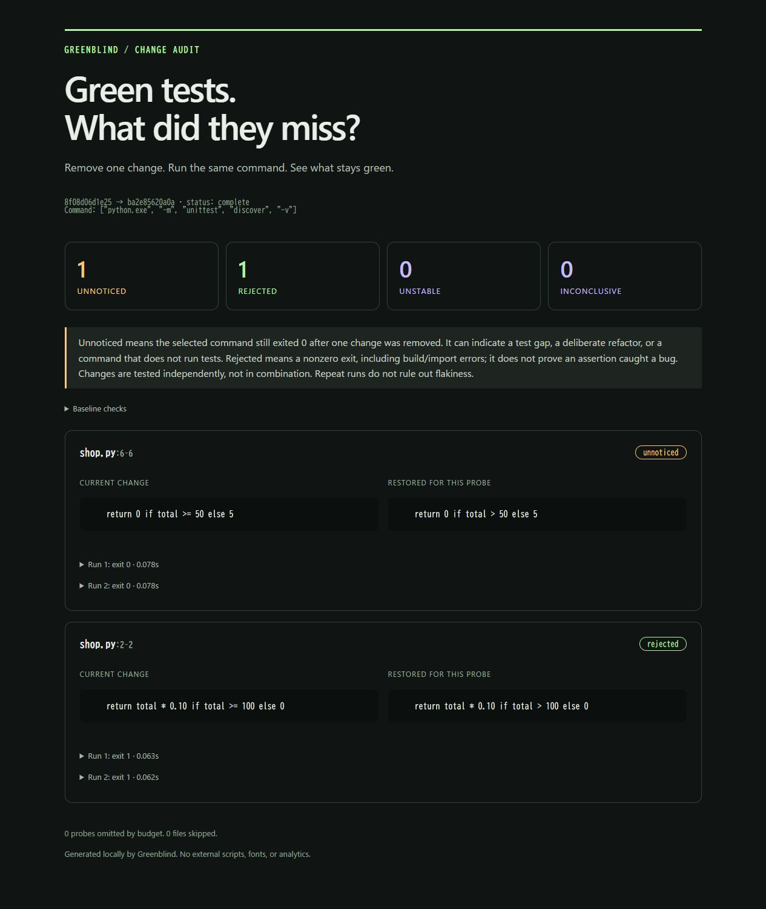

# Greenblind

**Which parts of your PR can disappear while tests stay green?**

Greenblind removes one changed region at a time in a fresh copy of your committed code, reruns your command, and shows the changes it did not notice.

No model. No API key. No runtime dependencies. Python 3.11+ and Git.

```text
Two boundary fixes. Passing tests. One blind spot.

  rejected     shop.py:2   discount: > 100 → >= 100
  unnoticed    shop.py:6   shipping: >  50 → >=  50

The shipping fix disappeared. The tests still passed.
```

[日本語](README.ja.md) · [How it works](docs/design.md) · [Related work](docs/related-work.md)

**Real-history check:** in more-itertools, a guard removal went unnoticed before its regression tests were added and was rejected afterward. [Reproduce the comparison](docs/case-study.md).

A second [focused Node example](docs/node-example.md) checks an ansi-regex change without third-party dependencies.



## Try it in 30 seconds

```sh
git clone https://github.com/Hum1Tab/greenblind.git
cd greenblind
python -m greenblind demo
```

Open `.greenblind/demo/report.html`. The demo creates a disposable Git repository, runs real tests seven times, and leaves your checkout alone. It needs no package installation or network after cloning. On systems where Python is named `python3`, use that instead.

## Check your change

Preview the scope first. This reads Git objects but does not execute repository code:

```sh
python -m greenblind plan --repo /path/to/project --base HEAD~1 --include "src/*"
```

The plan lists region IDs, intentional exclusions, unsupported files, the probe budget, and the number of command executions. Add `--json` for scripts. It cannot predict whether dependencies are installed or tests will pass. A plan's exit 0 means planning succeeded, not that any test ran.

From the Greenblind checkout, install into a virtual environment:

```sh
python -m pip install .
```

Then, in the repository you want to check:

```sh
greenblind check --base HEAD~1 --include "src/*" -- python -m unittest discover -s tests
```

Or run it directly from the source checkout:

```sh
python -m greenblind check --repo /path/to/project --base HEAD~1 --include "src/*" -- python -m pytest -q
```

The command is an argument list after `--`, executed without a shell. Use a checked-in wrapper script for compound commands, setup, builds, or unusual test runners. Dependencies must already be available to that command. Greenblind does not copy ignored dependencies or install packages automatically.

**Explicitly include production paths.** Tests, fixtures, and configuration stay at HEAD unless you include them. Repeat `--include` for multiple paths and use `--exclude` to leave test files alone when tests live beside implementation:

```sh
greenblind check --base origin/main --include "src/*" --exclude "*.test.*" -- node --test
```

Globs use Python `fnmatchcase`: `*` matches `/` too. Quote globs on every shell. Revisions are exact comparisons, not an implicit merge-base; for a diverged PR, compute `git merge-base origin/main HEAD` and pass that SHA as `--base`. Dirty and untracked files are ignored, not modified.

## Read the result

| Result | What was observed |
| --- | --- |
| `unnoticed` | The command exited 0 every time after this region was restored to the base version. |
| `rejected` | The command consistently exited with the same nonzero code. This includes assertion failures, syntax errors, missing imports, and build failures. |
| `unstable` | Exit codes differed between repeats. |
| `inconclusive` | The command timed out or could not start. |

**Unnoticed is a review prompt, not an instruction to delete code.** It can reveal a missing test, but also a legitimate refactor or a command that ran zero tests. Greenblind observes exit codes; it does not claim to prove correctness, test discovery, coverage, or regression detection.

## Reports and CI

Every check writes a standalone HTML report, machine-readable JSON, and Markdown to `.greenblind/`. HTML needs no server or external assets. Reports include source excerpts and command arguments. Logs are omitted unless `--include-logs` is set. Review reports before sharing them.

```sh
greenblind check --base HEAD~1 --include "src/*" --limit 20 --timeout 30 --repeats 2 --fail-on-unnoticed -- python -m pytest -q
```

For `N` regions and `R` repeats, a full check runs the command `R × (N + 1) + 1` times. An empty plan runs no commands. Defaults: 30 regions, 2 repeats, 60 seconds per run. Budget omissions and unsupported selected files produce a partial report rather than a clean result. Intentional `--exclude` matches remain visible but do not make the report partial.

| Exit | Meaning |
| --- | --- |
| 0 | All selected probes completed consistently; unnoticed results are advisory by default. |
| 1 | `--fail-on-unnoticed` found at least one unnoticed region in a complete, stable check. |
| 2 | Incomplete, unstable, baseline failure/drift, no probes, invalid input, or execution error. |

Start advisory. Apply enforcement only to changes where tests should detect a behavior difference. See the [CI recipe](docs/ci.md).

## Boundaries

- Committed snapshots only; no stashing, resetting, or checking out your working tree.
- Each contiguous changed region is tested independently. Interacting changes can be inconclusive; this is not combinatorial minimization.
- UTF-8 text only; binary files and mode changes are reported as skipped. Added/deleted files are one probe each; renames appear as delete/add.
- Symlinks and submodules are rejected. Maximum snapshot size: 256 MiB. Git LFS blobs remain pointers. Git checkout filters are not applied.
- Every run starts with fresh tracked files. `.git`, ignored files, virtual environments, `node_modules`, and build caches are absent. Use a command that builds/tests the snapshot, not an editable install pointing at another checkout.
- Baselines run before and after probing. Repeats reduce obvious noise; they do not prove determinism. A failed final baseline invalidates interpretation of the run.
- Commands run with your permissions and inherited environment. Temporary copies are **not a security sandbox**. Run trusted code only, or use your own disposable container/VM. Commands must be foreground processes and clean up their services.

## Development

```sh
python -m unittest discover -s tests -v
```

Tests exercise real Git repositories, Python and optional Node commands, fresh snapshots, dirty checkout preservation, timeout handling, exact text reversal, and report escaping. [Contributions](CONTRIBUTING.md) are welcome, especially reproducible cases where an unnoticed result helped improve a test.

MIT licensed. Early experimental release. No telemetry.
